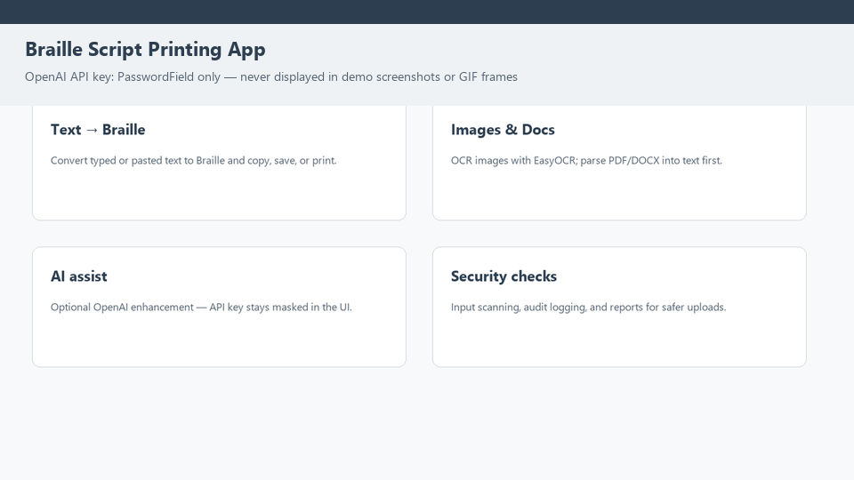
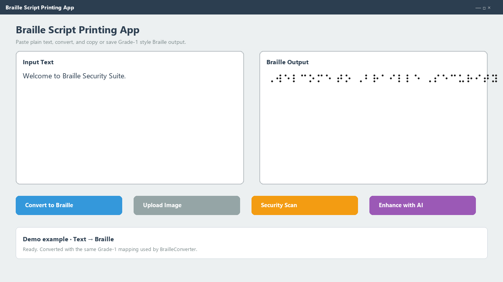
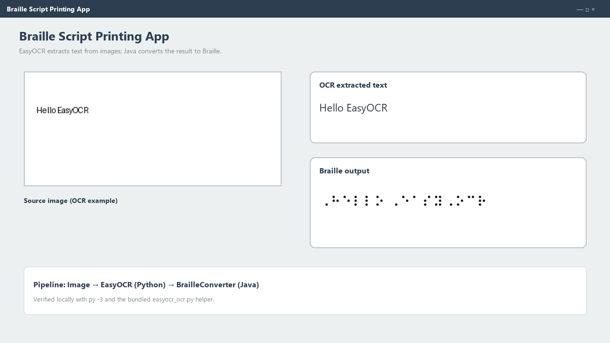
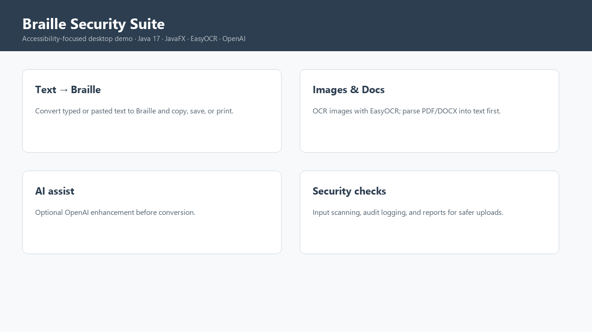

# Braille Security Suite

A Java desktop application that converts **text, images, and documents to Braille**, with optional OpenAI text enhancement, EasyOCR image extraction, and input security checks.

> **Portfolio note:** This is a **desktop (JavaFX)** app — not a hosted web demo. Use the GIF and screenshots below, or clone and run locally.

## Demo



### Screenshots

| Live UI | Text → Braille |
| --- | --- |
|  |  |

| OCR pipeline | Overview |
| --- | --- |
|  |  |

**Example used in the demo** (`docs/demo/examples/01-text-to-braille.txt`):

```
INPUT:   Welcome to Braille Security Suite.
BRAILLE: ⠠⠺⠑⠇⠉⠕⠍⠑ ⠞⠕ ⠠⠃⠗⠁⠊⠇⠇⠑ ⠠⠎⠑⠉⠥⠗⠊⠞⠽ ⠠⠎⠥⠊⠞⠑⠲
```

More examples and regeneration notes: [`docs/demo/README.md`](docs/demo/README.md).

## Features

### Core Functionality
- **Text-to-Braille Conversion**: Convert plain text to Braille script
- **OCR Support**: Extract text from images using EasyOCR (Python)
- **Document Parsing**: Parse PDF and DOCX files to extract text
- **AI Enhancement**: Integrate with OpenAI API for text optimization
- **Braille Printing**: Print Braille output to physical printers

### Security Features
- **File Security Scanning**: Malware / threat-oriented checks on inputs
- **Penetration Testing**: Automated vulnerability assessment helpers
- **Input Validation**: SQL injection, XSS, and command injection checks
- **Audit Logging**: Security event tracking
- **Security Reporting**: Summary reports from scans

## Technology Stack

- **Java 17** + **JavaFX** desktop UI
- **Maven** build
- **EasyOCR** (Python) for image OCR
- **Apache POI** / **PDFBox** for DOCX and PDF
- **OpenAI API** for optional text enhancement

## Prerequisites

- Java 17 or higher
- Maven 3.6 or higher
- Python 3 with EasyOCR (`pip install -r requirements-ocr.txt`) for image text extraction
- OpenAI API key (optional; for AI enhancement)

## Installation

1. **Clone the repository**
   ```bash
   git clone https://github.com/vishtechie07/braille-security-suite.git
   cd braille-security-suite
   ```

2. **Install EasyOCR (Python)**
   - Install [Python 3](https://www.python.org/downloads/) and ensure `python` or `py` is on your `PATH`.
   - From the project root:
   ```bash
   pip install -r requirements-ocr.txt
   ```
   - The first time you run OCR, EasyOCR may download model files (can take several minutes).

3. **Build the project**
   ```bash
   mvn clean compile
   ```

## Usage

### Running the Application

```bash
mvn javafx:run
```

Or use `run.bat` (Windows) / `./run.sh` (Linux/macOS).

### Basic Workflow

1. Enter or paste text (or upload image / PDF / DOCX)
2. Click **Convert to Braille**
3. Optionally **Enhance with AI** (requires API key)
4. **Copy**, **Save .txt**, or **Print Braille**

### Security actions

1. **Security Scan** — analyze input for risky patterns  
2. **Penetration Test** — run assessment helpers  
3. **Security Report** — view summary statistics  

## Project Structure

```
src/main/java/.../brailleapp/   # JavaFX UI + services + security
src/main/resources/ocr/         # EasyOCR Python helper
docs/demo/                      # Screenshots, GIF, example I/O
scripts/generate_demo_assets.py # Regenerate demo media
requirements-ocr.txt
```

## Configuration

### OpenAI API Key
1. Get a key from [OpenAI Platform](https://platform.openai.com/api-keys)
2. Paste it in the app and click **Save Key**

### EasyOCR
```bash
pip install -r requirements-ocr.txt
```

## Troubleshooting

- **OCR not available** — install Python 3 + `pip install easyocr`, restart the app  
- **Maven build fails** — confirm Java 17+ and Maven 3.6+  

## Security Logs

- `security_logs/security_audit.log`
- `security_logs/threat_detection.log`
- `security_logs/vulnerability_scan.log`

## License

MIT — see [LICENSE](LICENSE) if present.

## Acknowledgments

- [EasyOCR](https://github.com/JaidedAI/EasyOCR), [Apache POI](https://poi.apache.org/), [PDFBox](https://pdfbox.apache.org/), [OpenAI](https://openai.com/), [JavaFX](https://openjfx.io/)

**Note:** Educational / professional use. Only run security tests where you are authorized.
